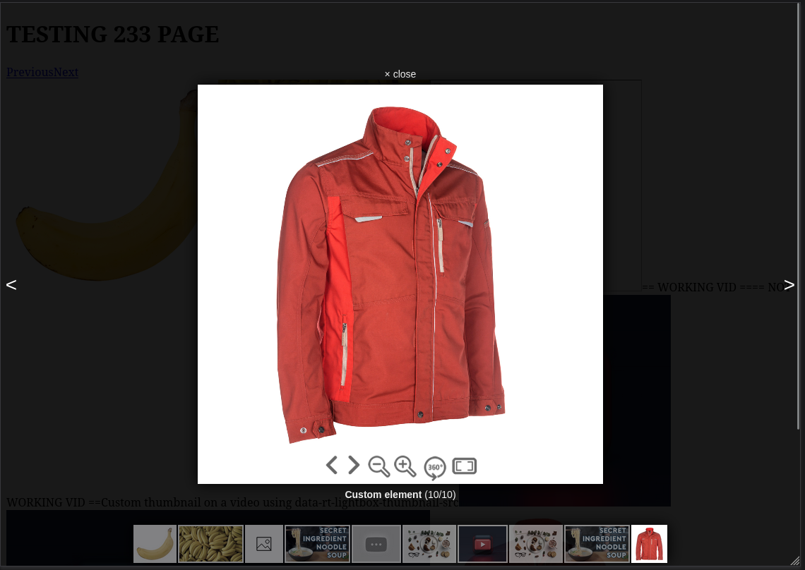

# rtjs
Handy everyday library. More to come.

## Lightbox extension

### Install
```js
npm install @rtjs/rtjs
...
import {RTJS_lightbox} from '@rtsoft/rtjs'
```

or 

```html
<script src="https://unpkg.com/@rtsoft/rtjs@latest/lib/RTJS.js"></script> 
```

### Usage

* multile elements can be linked to one gallery by `data-rt-lightbox-gallery`
* path to image is determined by `href` | `data-rt-lightbox-src`
* title is determined by `title` | `data-rt-lightbox-title`
* path to thumbnail is determined by `data-rt-lightbox-thumbnail-src` | inner  `src`

```html
<div>
    <a href="[path_to_big_image]" class="lightbox" data-rt-lightbox-gallery="[gal_id]" data-rt-lightbox-title="[title]">
        
    </a>
    <a href="[path_to_big_image]" class="lightbox" data-rt-lightbox-gallery="[gal_id]" title="[title]">
        no thumbnail
    </a>
    <a href="[path_to_big_image]" class="lightbox" data-rt-lightbox-gallery="[gal_id]" data-rt-lightbox-title="[title]">
        
    </a>
</div>
```
```js
RTJS_lightbox('.lightbox', {
    closeLabel: 'close',
    showTitle: true,
    showArrows: true,
    showThumbnails: true,
    debug: false,
    imageErrorLabel: 'Image could not be loaded',
    withoutBorder: false,
    titlePlacement: 'top'
    onOpened: (index) => {
        console.log('opened', index)
    },
    onClosed: (index) => {
        console.log('closed', index)
    },
    onItemChanged: (index) => {
        console.log('changed', index)
    }
})
```

or data can be provided directly while initing

```html
<span id="data-lightbox">click me</span>
```
```js
RTJS_lightbox('#data-lightbox', {
    data: [
        {bigSrc: "[path_to_big_image]", title: "[title]", smallSrc: "[path_to_thumbnail]"},
        {bigSrc: "[path_to_big_image]", title: "[title]", smallSrc: "[path_to_thumbnail]"},
        {bigSrc: "[path_to_big_image]", title: "[title]", smallSrc: "[path_to_thumbnail]"},
    ]
})
```

## RTJS_lightbox options
### customItemsProvider (adding your own content types)
- do not use content types that are already handled by the application when writing your handlers (such as image, iframe, ...)
- customItemsProvider is an array of custom content type handlers (js objects with specific fields)
- each content type handler is an object with the following properties:
    - (required) **contentType** - the name of your custom content type, the lightbox will throw an exception when it encounters the content type of a gallery item that is not handled by the default providers or through one of your providers
    - (optional) **onItemMount** - called when the user opens a gallery item with this content type (either through opening the gallery at this item or through switching to an item of this content type from another item), useful for mounting your own components into the lightbox by querying for the **rt-gallery-item** div which is created by the lightbox before onItemMount is called
    - (optional) **onItemUnmount** - called after the user exists the gallery or moves onto another item - useful for other logic that should be done after unmounting (note the component created by createRoot is removed automatically from the DOM)
- 

example of mounting custom component onto the data-rt-content-type="360-renderer":
```js
customItemsProvider: [
    {
        // our custom content type
        contentType: "360-renderer",
        // mounting method called when the user gets to a gallery
        // item of this content type
        onItemMount: (index, item) => {
            console.log("360 mount", index, item);
            // mount our component
            mount3dComponent();
        },
        // cleanup method
        onItemUnmount: (index, item) => {
            console.log("360 unmount", index, item);
            // no need for additional logic here
            // but some could be added later
        },
    }
]

// Our custom mount function (React is used in this example)
const mount3dComponent = () => {
    // mount onto the element that was created by the lightbox
    // the element looks something like:
    // <div id="rt-gallery-item"></div>
    const mountPoint = document.getElementById("rt-gallery-item");
    const root = createRoot(mountPoint);
    root.render(<CustomContainer />);
}

```


## Gallery data structure
### Common data (all content types use this data)
#### contentType
- determines the content type (such as an image or an iframe video) of this gallery item
- values:
    - image
    - iframe
    - (or your custom content types provided they are handled)
- implicitly set to image when no value is explicitly specified
- you can specify a custom content type with any value as long as you provide a custom handler for your new content type by passing a **customItemsProvider** object to the **RTJS_lightbox** function
- the lightbox will throw an error when it encounters an element with an unsupported content type (one that is not handled by the application or your own custom handlers)

- To set this value through the DOM use
**data-rt-content-type** attribute on the \<a> element representing the gallery item

#### title
- the title of the gallery item
- DOM: **data-rt-lightbox-title** on the element representing the gallery item
#### description
- the description of the gallery item to be shown under the title in the gallery
- DOM: **data-rt-lightbox-description** on the element representing the gallery item
#### smallSrc
- path to the small thumbnail image (if there is any) in the gallery lightbox display
- if you are using an iframe with youtube videos, then you *do not need* to specify the thumbnail as it will be taken directly from the yt thumbnail URL at maximum quality (specifying the thumbnail src for custom images is fine as well)
- To set this value through the DOM either specify **data-rt-lightbox-thumbnail-src** or provide an \ element with a src tag under the main \<a> element
- If both **data-rt-lightbox-thumbnail-src** is specified and there is an \ element with a src attribute under the main \<a> tag, then **data-rt-lightbox-thumbnail-src** takes precedence, this is done even if the attribute is set to an empty string "" - in that case either the placeholder will be used or possibly the default placeholder value (such as an automatically fetched thumbnail for iframe youtube videos)
---

### Data specific to various content types
#### image
##### bigSrc
- path to the image shown in the opened gallery lightbox display
- To set this value through the DOM either use the **href** attribute or the **data-rt-lightbox-src** attribute on the main \<a> element

#### iframe
##### sourceUrl
- path to the iframe source (for youtube videos use www.youtube.com/embed/VIDEO_ID)
- To set this value through the dom use **data-rt-source-url** on the \<a> element representing the gallery item (or use **href**)
##### iframeWidth
- The width of the iframe as it appears in the viewport, any normal css unit value is allowed but it's highly encouraged to use vw responsive values; if no value is set the default will be used
- To set this value through the dom use **data-rt-iframe-width** on the \<a> element representing the gallery item

##### allowFullscreen
- defaults to true
- takes a boolean value
- DOM: **data-rt-allow-fullscreen** - takes "true" or "false" in the DOM
##### allow
- used for applying allow="..." to the iframe
- defaults to "accelerometer; autoplay; clipboard-write; encrypted-media; gyroscope; picture-in-picture; web-share"
- DOM: **data-rt-iframe-allow**
##### frameborder
- used for applying frameborder="..." to the iframe
- defaults to 0 when not provided
- DOM: **data-rt-iframe-frameborder**

#### iframe example (video with a title and a description with a youtube fetched thumbnail)
```js
<a
    className="lightbox"
    data-rt-lightbox-gallery="1"
    data-rt-lightbox-title="Secret ingredient noodle soup"
    data-rt-lightbox-description="Secret ingredient noodle soup description"
    data-rt-content-type="iframe"
    data-rt-source-url="https://www.youtube.com/embed/cee6883w2Nk"
>
    == WORKING VID ==
</a>
```


### iframe example - same video but with a custom thumbnail (only the thumbnail in the bottom bar has changed with the previous example)
```js
const FOOD_TABLE = require("./../images/food-table.webp").default;

// ...

<a
    className="lightbox"
    data-rt-lightbox-gallery="1"
    data-rt-lightbox-title="Video with a custom thumbnail"
    data-rt-content-type="iframe"
    data-rt-source-url="https://www.youtube.com/embed/cee6883w2Nk"
    // newline
    data-rt-lightbox-thumbnail-src={FOOD_TABLE}
>
    Custom thumbnail on a video using data-rt-lightbox-thumbnail-src
</a>
```


### custom content type example - using React + Gatsby - 3D rotation viewer
```js

// gallery element
// custom content type 360-renderer
<a
    className="lightbox"
    data-rt-lightbox-gallery="1"
    data-rt-content-type="360-renderer"
    data-rt-lightbox-title="Custom element"
>
    
</a>

// start of our react component
// state variables used for managing gatsby script dependencies
const [loaded1, setLoaded1] = useState(false);
const [loaded2, setLoaded2] = useState(false);

// mounting function
const mount3dComponent = () => {
    const mountPoint = document.getElementById("rt-gallery-item");
    const root = createRoot(mountPoint);
    // mount or custom react component onto the gallery item (rt-gallery-item)
    root.render(<CustomContainer />);
}


// RTJS_lightbox with custom handler
RTJS_lightbox(".lightbox", {
    ...
    customItemsProvider: [
        {
            contentType: "360-renderer",
            onItemMount: (index, item) => {
                console.log("360 mount", index, item);
                mount3dComponent();
            },
            onItemUnmount: (index, item) => {
                console.log("360 unmount", index, item);
            },
        }
    ]
})

// ...
// dependent scripts
<Script src="http://localhost:8000/skin.js" onLoad={() => setLoaded1(true)} />
{loaded1 && <Script src="http://localhost:8000/object2vr_player.js" onLoad={() => setLoaded2(true)} />}
{loaded2 && <Script id="3" dangerouslySetInnerHTML={{__html: `

function hideUrlBar() {
}


console.log("adding event listener...");

// Called inside <CustomContainer />
document.addEventListener("rtjs:load", function() {
    console.log("rtjs is loading...");
    // create the object player with the container
    obj=new object2vrPlayer("container");
    // add the skin object
    skin=new object2vrSkin(obj);
    // load the configuration
    obj.readConfigUrl("./index_out.xml");
    // hide the URL bar on the iPhone
    setTimeout(function() { hideUrlBar(); }, 10);
});

`}} />}


// custom-container.js
import { useMediaQuery } from '@uidotdev/usehooks';
import React, { useEffect } from 'react';

const CustomContainer = () => {

    const isSmaller = useMediaQuery('(max-width: 900px)');
    useEffect(() => {
        // dispatching the event to load the library
        console.log("dispatching event...");
        document.dispatchEvent(new CustomEvent('rtjs:load'));
    }, []);

    return (
        
      <div id="container" style={{
        margin: "0px auto",
        width: isSmaller ? "80vw" : "50vw",
        maxHeight: "70vh",
        aspectRatio: 1,
      }}>
      This content requires HTML5 &amp; Javascript or Adobe Flash Player Version 9 or higher.
      </div>

    );
}

export default CustomContainer;


```

Result
